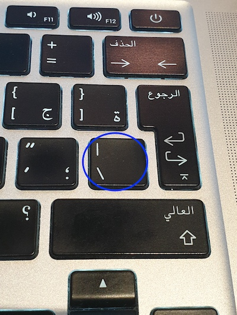

# Writing Good Documentation

## Step - 1 Using Codeblocks.

Codeblocks in markdown make it *very easy* for tech people to **copy, paste, share** code.
A good __Cloud Engineer__ uses codeblocks whenever possible.

Because it allows others to copy and paste their code to replicate or research issues. 

- In order to create codeblocks in markdown you need to use three back-ticks (`)
- Not to be confused with quotations. (')

```
def factorial(n):
    if n == 0:
        return 1
    else:
        return n * factorial(n - 1)

# Example usage:
number = 5
result = factorial(number)
print(f"The factorial of {number} is {result}")

```


- When you can you should attempt to apply syntax highlighting to your codeblocks 

```python
def factorial(n):
    if n == 0:
        return 1
    else:
        return n * factorial(n - 1)

# Example usage:
number = 5
result = factorial(number)
print(f"The factorial of {number} is {result}")

```

- Make note of where the back-tick character keyboard key is located.
- It should appear next to letter "Z" key on the keyboard.
- But may vary based on your keyboard.


Good cloud Engineers use codeblocks for both Code and Errors that appear in the console.

```bash

NameError: name 'undefined_variable' is not defined 

```
> Here is an example of using a codeblock for an error that appears in bash.

## Step 2 - How to take Screenshots

A screen short is when you capture a part of your screen from your la[top or desktop.

This is not to be confused with taking a photo with your phone.

***DON'T DO THIS***

## Step 3 - Use Github Flavoured Markdown Task Lists

Github extends Markdown to have a list where you can check off items. [<sup>[1]</sup>](#external-references)

- [x] Finish Step 1
- [ ] Finish Step 2
- [x] Finish Step 3

## Step 4 - Use Emojis (Optional)

GitHub Flavored Markdown (GFM) supports emoji short-codes.

| Name | Short-code | Emoji |
| --- | ---| --- |
| Cloud | `:cloud:` | :cloud: |
| Cloud with lightning | `:cloud_with_lightning:` | :cloud_with_lightning: |

## Step 5 - How to create Table

You can use the following markdown format to create tables:

```md
| Name | Short-code | Emoji |
| --- | ---| --- |
| Cloud | `:cloud:` | :cloud: |
| Cloud | `:cloud_with_lightning:` | :cloud_with_lightning: |
```

Github extends the functionality of markdown tables to provide more alignment and table cell formatting options. [<sup>[2]</sup>](#external-references)

- Make note of where the pipe character keyboard key is located.
- It should appear above "Right Shift" key on the keyboard.
- But may vary based on your keyboard.



## External References

- [GitHub Flavored Markdown Spec](https://github.github.com/gfm/)

- [Basic writing and formatting syntax](https://docs.github.com/en/get-started/writing-on-github/getting-started-with-writing-and-formatting-on-github/basic-writing-and-formatting-syntax)

- [BFM - Task Lists](https://docs.github.com/en/get-started/writing-on-github/getting-started-with-writing-and-formatting-on-github/basic-writing-and-formatting-syntax#task-lists)<sup>1</sup>

- [BFM - Emoji Cheat Sheet](https://github.com/ikatyang/emoji-cheat-sheet/)

- [BFM - Table (with extension) Sheet](https://github.github.com/gfm/#tables-extension-)<sup>2</sup>

